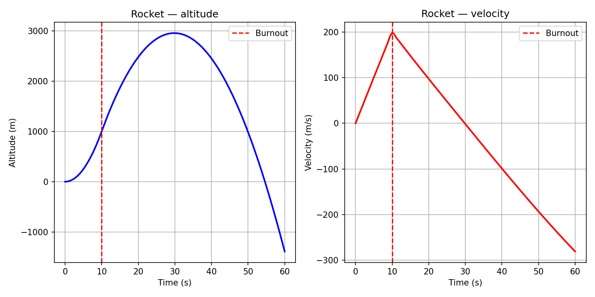
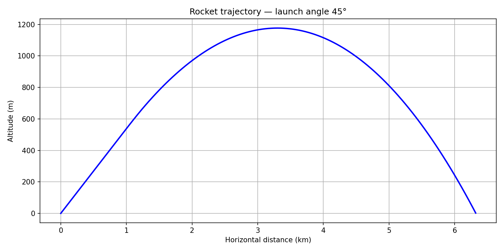
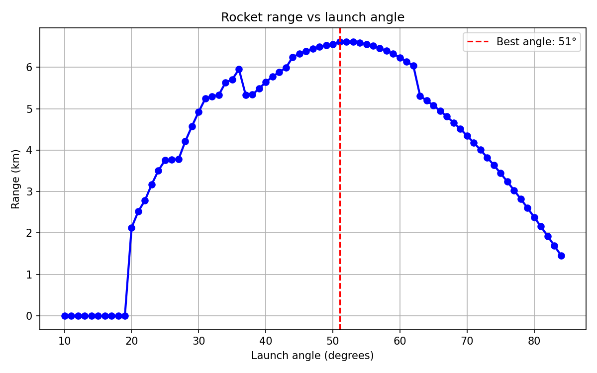

# project2-rocket-trajectory
2D rocket trajectory simulation in Python, parametric launch angle study

# Project 2 - Rocket Trajectory Simulation

**Status: Complete**  
**Tool: Python - SciPy, NumPy, Matplotlib**  
**Author: Manya Tiwari | Aerospace Engineering Year 2 | KIIT University**

## What this project does
Simulates a rocket launch with three forces acting 
simultaneously - engine thrust, aerodynamic drag, 
and gravity. Models both vertical and 2D trajectory. 
Finds the optimal launch angle for maximum range 
through a parametric study.

## The physics
The rocket's motion is governed by Newton's second law.
Net acceleration = (Thrust - Drag) / mass - gravity

During engine burn (0-10 seconds):
- Thrust: 15,000 N upward along launch direction
- Drag: opposes motion, D = 0.5 × ρ × v² × Cd × A
- Gravity: 9.81 m/s² downward always

After burnout (10 seconds onwards):
- Thrust: 0 N
- Drag and gravity continue acting

## Rocket parameters
| Parameter | Value |
|-----------|-------|
| Mass | 500 kg |
| Thrust | 15,000 N |
| Burn time | 10 s |
| Drag coefficient | 0.3 |
| Reference area | 0.05 m² |

## Results

### 1D vertical simulation
| Result | Value |
|--------|-------|
| Peak altitude | 2958.8 m |
| Peak velocity | 197.4 m/s |

### 2D trajectory at 45°
| Result | Value |
|--------|-------|
| Peak altitude | 1176.8 m |
| Range | 6.33 km |

### Parametric study — optimal launch angle
| Result | Value |
|--------|-------|
| Angles tested | 10° to 84° in 1° steps |
| Optimal launch angle | 51° |
| Maximum range | 6.62 km |

## Key finding
Without air resistance physics predicts 45° as the 
optimal launch angle. With aerodynamic drag included, 
the optimal angle shifts to 51° - higher than the 
theoretical 45° in this configuration because the 
thrust-to-weight ratio and drag parameters favour 
a steeper initial climb to reach thinner air faster 
before the horizontal glide phase.

Initial study used 5° resolution suggesting optimum 
near 55°. Refined to 1° resolution confirming exact 
optimal angle of 51°.

## Graphs

### 1D trajectory - altitude and velocity

### 2D trajectory arc at 45°

### Range vs launch angle - parametric study

## Skills used
Python · SciPy solve_ivp · NumPy · Matplotlib ·  
ODE simulation · Parametric analysis · 
Newton's laws of motion · Aerodynamic drag modelling

## Files
- `rocket_trajectory.py` - 1D vertical simulation
- `rocket_2d.py` - 2D trajectory with launch angle
- `parametric_study.py` - range vs angle parametric study

## Connection to Project 1
Project 1 solved a control problem - how to maintain 
a target altitude using PID feedback. Project 2 solves 
a simulation problem - given known physics, where does 
the rocket go? Together they demonstrate both control 
systems and trajectory analysis in aerospace engineering.
